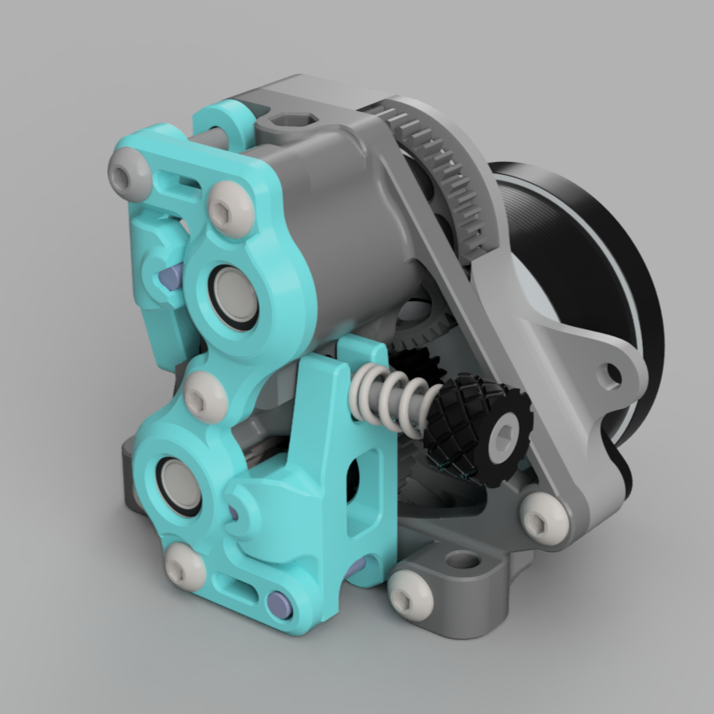
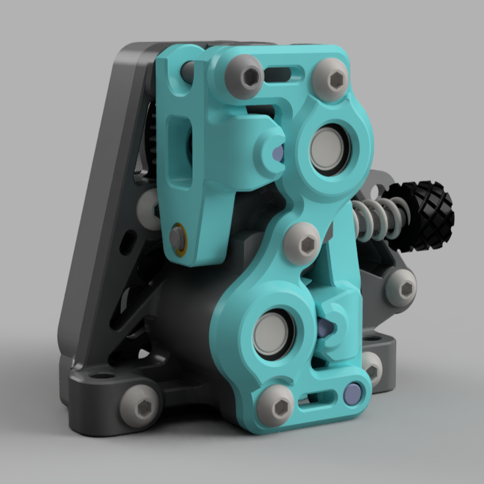

# Sherpa *Crew* Mini [Issue #6](https://github.com/VoronDesign/Voron-Afterburner/issues/6) Slayer

## Product Info

The Sherpa Crew Mini is a 3d printer extruder that uses two sets of Bondtech (or any other clone) 5mm gears.  It is designed to allow for smooth layer stacking (provided no other motion parts on your printer have any issues), slaying the pesky [Voron Issue #6](https://github.com/VoronDesign/Voron-Afterburner/issues/6) and [Prusa3d Issue #602](https://github.com/prusa3d/Prusa-Firmware/issues/602).  It is compact and it uses a single thumbscrew for even pressure on both the upper and lower gears. 

## Mechanics
The extruder uses upper and lower 50T gears meshed with one another.  Notice that the backlash for these two gears is **not** adjustable.  If you are pushing a lot of current through the motor (i.e. more than 0.8A RMS) this might be a problem; otherwise, practically, the mechanism seems to work fine.  The motor backlash to the lower 50T gear *is* adjustable, and should work with 8T, and 10T gears.

Notice also that the lower gearset guilder is meant to run with a bushing to replace the idler drive gear on the original bondtech set. It is [5mm ID x 8mm OD and 10mm in length](https://www.amazon.com/dp/B09CD8QSG3?psc=1&ref=ppx_yo2ov_dt_b_product_details).   The upper gearset uses the standard configuration.

## Standing on the shoulder of giants: the many who made this extruder possible
The sherpa crew mini is a derivative work from [Churls Double Sherpa](https://github.com/Annex-Engineering/Annex-Engineering_User_Mods/tree/main/Extruders/Sherpa_Mini/Extruder_Mods/Churls-Double_Sherpa_Mini) and the work by the Voron and the 3d printer community at large on helping with creative ways to slay [Issue #6](https://github.com/VoronDesign/Voron-Afterburner/issues/6) (i.e. inconsistent extrusion).  As a derivate work from Annex Engineering, the product [license](https://github.com/Annex-Engineering/ANNEX-Engineering-License-Agreement) is the same as the original [Sherpa Mini](https://github.com/Annex-Engineering/Sherpa_Mini-Extruder/).

Thanks to: [Aneex Engineering](https://store.annex.engineering/) for the original design; to Meelis on discord for his tiredlessly, obsessive characterization and testing of different extruders, and the grandfather of this extruder design; and to the Voron community for all of the support.

Happy printing!
